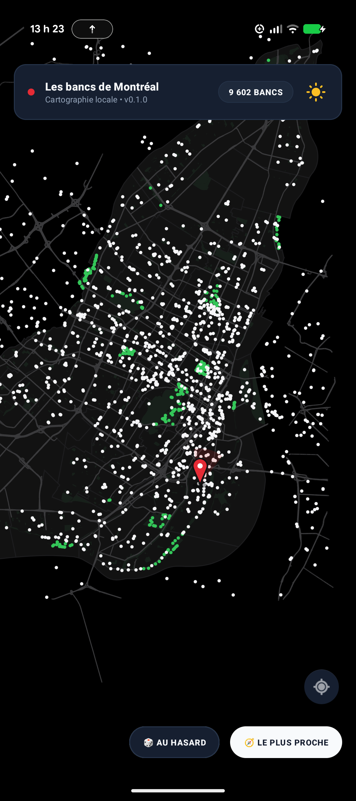

# BenchMap (Les bancs de Montréal) 🪑

> *« S'asseoir à Montréal n'est pas un geste anodin : c'est habiter la ville à hauteur de regard, faire corps avec ses ruelles ombragées, ses parcs centenaires et ses rives fluviales. BenchMap est un atlas vectoriel hors-ligne, conçu dans le respect de l'esprit typographique suisse, offrant à chaque marcheur, flâneur et citoyen une cartographie souveraine, instantanée et intime des 9 602 bancs publics de la métropole. Zéro trace, zéro serveur, pure liberté urbaine. »*

[](LICENSE)
[](https://android.com)
[]()
[](https://donnees.montreal.ca/)

A 100% local-first, privacy-respecting, native vector map of all **9,602 public benches** across the Island of Montreal. Built with a custom hardware-accelerated Canvas engine, zero external tiles, zero cloud dependencies, and an authentic Swiss graphic design aesthetic.

---

## Features / Fonctionnalités

- **100% Offline Vector Rendering**: Custom Canvas engine rendering authentic physical island shorelines (Île de Montréal, Île des Sœurs, Île Sainte-Hélène, Île Notre-Dame, Île Bizard, Île de la Visitation), 1,648 municipal parks, 29,708 street segments, and 9,602 benches via OpenGL `drawLines` hardware batching.
- **🎨 8 Styles Cartographiques & Rotation Quotidienne**:
  - Un style graphique différent chaque jour de la semaine ou sélection manuelle :
    - *Swiss Clean* (Standard architectural)
    - *Architectural Hairline* (Lignes fines de dessin technique)
    - *Bauhaus Gras* (Postérisation graphique affirmée)
    - *Cadastre Tireté* (Lignes pointillées cadastre)
    - *Double Casing* (Boulevards et avenues à double tracé)
    - *Tracé Artistique* (Esquisse organique et traits vivants)
    - *Matrice Pointillée* (Texture pointilliste)
    - *Noir Argentique* (Monochrome contrasté)
- **👆 Gestuelle Fluide & Boussole Interactive**:
  - **Double-tap zoom** : Zoom instantané et centrage fluide sur la zone tapée.
  - **Rotation libre à 2 doigts** : Orientation de la carte avec retour haptique d'aimantation au Nord.
  - **Épingles verticales stabilisées** : Les épingles (position courante et ami) contre-pivotent automatiquement pour rester toujours droites et verticales face à l'utilisateur, quelle que soit l'orientation de la carte.
  - **Boussole Swiss** : Indique le Nord magnétique en continu ; un simple tap réinitialise l'orientation au Nord et effectue un zoom avant.
- **Ultra-Fast Binary Map Format**: Custom IEEE 754 float binary format (`montreal_map.bin`) loads the complete municipal bench cartography in **<70 ms** with zero JSON garbage collection overhead.
- **Dual Swiss Themes**:
  - **Nordic Paper & Precision Ink (Light)**: Warm architectural paper, sage green parks, crisp arterial slate lines, and deep charcoal bench markers.
  - **Swiss Nocturne (Dark / OLED)**: True pitch-black oceanic water, matte obsidian slate landmass, and high-contrast chalk platinum / luminous mint emerald dots.
- **Every Bench Linked to Street & Park**: Spatial matching connects every bench to its actual street name (e.g., *Rue du Centre*, *Rue Wellington*, *Boulevard Saint-Laurent*) and park name.
- **Smart Discovery**:
  - 🎲 **Au hasard (Random Bench)**: Jump to any surprising bench on the island.
  - 🧭 **Le plus proche (Nearest Bench)**: Instant Euclidean k-NN search to locate your closest seat.
  - 📍 **Turn-by-turn Walking Directions**: One-tap intent to start pedestrian navigation in OsmAnd, Organic Maps, or Google Maps.
  - ↗ **Share Coordinates**: Easy Swiss card formatting to share meeting points.
- **🤝 Rendez-vous à mi-chemin (Local & Anonymous Social Meetup)**:
  - **Zero-Cloud Location Keys**: Friends export/import an obfuscated, scrambled token (e.g. `BM1-7K9P-X4W2-9D`) via Signal, WhatsApp, or SMS with **zero servers, zero accounts, and zero cloud tracking**.
  - **Privacy Blur Levels**: Choose exact coordinates, subtle ~150 m street blur, or ~300 m neighborhood blur to protect home address privacy.
  - **Fair Halfway Filtering**: Mathematical fairness algorithm finds candidate benches located at the exact halfway midpoint between both friends, minimizing walking time disparity.
  - **Interactive Meetup Mode**: Live geodesic connecting axis, Cobalt Blue friend pin, glowing amber candidate halos, and real-time travel comparison (`Vous: 1,4 km • Ami: 1,4 km (Écart: 20 m)`).
- **100% Private & Open Source**: No tracking, no analytics, no ads, no cloud accounts, and no Google Play Services dependencies.

---

## Screenshots

| Nordic Paper (Light Mode) | Swiss Nocturne (Dark Mode) |
| :---: | :---: |
|  |  |

---

## Tech Stack

- **Platform**: Android 10+ (API 29 to API 34)
- **Language**: Java 17
- **UI Architecture**: Hardware-accelerated Custom View (`MontrealBenchMapView.java`) + Material Components 3
- **Spatial Indexing**: 2D Uniform Spatial Grid partitioning over WGS 84 Web Mercator projection
- **Data Source**: [Données ouvertes — Ville de Montréal](https://donnees.montreal.ca/)

---

## Building from Source

### Prerequisites
- JDK 17
- Android SDK (API 34, Build-Tools 34.0.0)

### Clone & Build
```bash
git clone https://github.com/tripledoublev/bancs-publics.git
cd bancs-publics

# Build Debug APK
./gradlew assembleDebug

# Build Production Release APK
./gradlew assembleRelease

# Build Google Play App Bundle (.aab)
./gradlew bundleRelease
```

Output APK will be located at:
`app/build/outputs/apk/release/app-release-unsigned.apk` (or signed if `benchmap-release.jks` is provided).

---

## License

This project is licensed under the MIT License - see the [LICENSE](LICENSE) file for details.
Data provided under the [Données ouvertes de la Ville de Montréal](https://donnees.montreal.ca/) open license.
