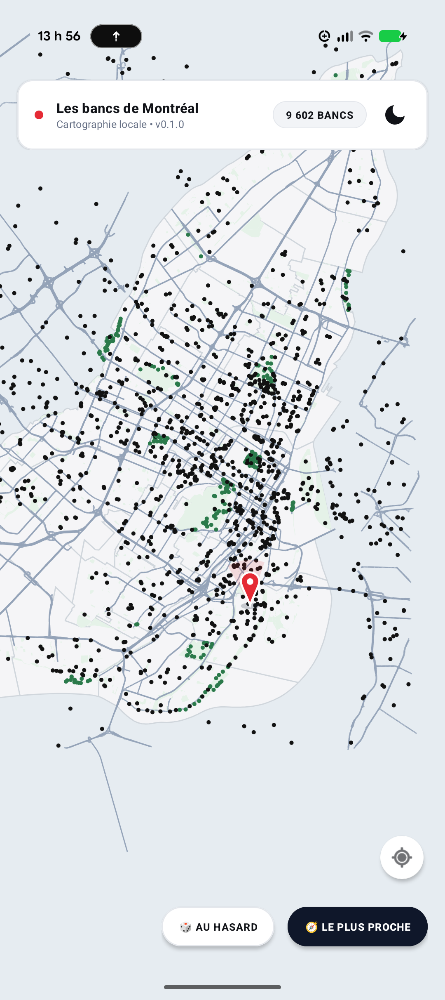
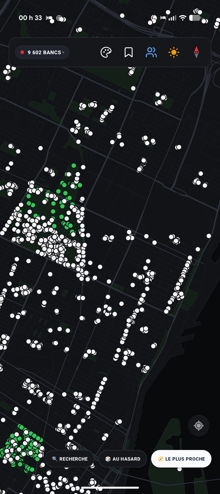
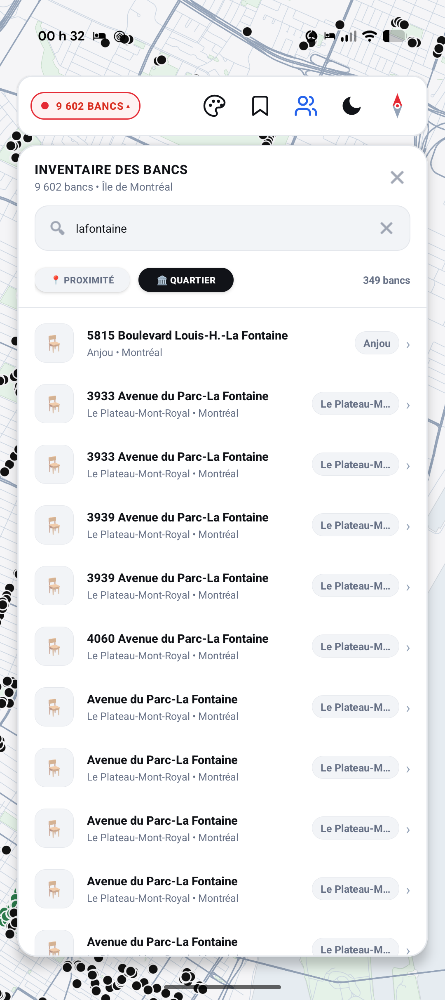
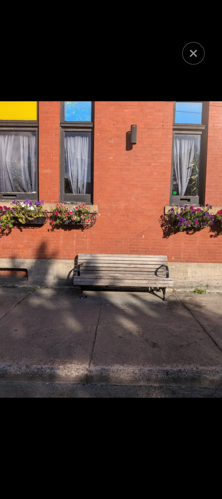

# Bancs publics 🪑

> *« S'asseoir à Montréal n'est pas un geste anodin : c'est habiter la ville à hauteur de regard, faire corps avec ses ruelles ombragées, ses parcs centenaires et ses rives fluviales. Bancs publics est un atlas vectoriel hors-ligne, conçu dans le respect de l'esprit du minimalisme, offrant à chaque marcheur, flâneur et citoyen une cartographie instantanée et intime des 9 602 bancs publics de la métropole. Zéro trace, zéro serveur, pure liberté urbaine. »*

[](LICENSE)
[](https://android.com)
[]()
[](https://donnees.montreal.ca/)

A 100% local-first, privacy-respecting, native vector map of all **9,602 public benches** across the Island of Montreal. Built with a custom hardware-accelerated Canvas engine, zero external tiles, zero cloud dependencies, and an authentic minimalist design aesthetic.

---

## Features / Fonctionnalités

- **100% Offline Vector Rendering**: Custom Canvas engine rendering authentic physical island shorelines (Île de Montréal, Île des Sœurs, Île Sainte-Hélène, Île Notre-Dame, Île Bizard, Île de la Visitation), 1,648 municipal parks, 29,708 street segments, and 9,602 benches via OpenGL `drawLines` hardware batching.
- **📋 Inventaire Exhaustif des 9 602 Bancs Publics**:
  - Un simple tap sur le badge **« 9 602 BANCS ▾ »** déploie la liste complète de tous les bancs publics de l'Île de Montréal.
  - **Tri dynamique** : par **Proximité** (distance en mètres/km par rapport à votre position ou au centre de la carte) ou par **Quartier** (ordre alphabétique des arrondissements et parcs).
  - **Recherche textuelle ultra-rapide** : Indexation instantanée avec normalisation des accents et caractères spéciaux (ex: taper *"lafontaine"* trouve immédiatement *"Parc La Fontaine"*).
  - **Navigation directe en un tap** : Cliquer sur un banc ferme la liste, centre la carte avec animation fluide et ouvre sa fiche technique.
- **🧭 Boussole Suisse Épurée & Bandeau Supérieur Ergonomique**:
  - Aiguille bicolore minimaliste intégrée comme dernière icône du bandeau (Rouge suisse `#E52B35` pour le Nord, Ardoise pour le Sud).
  - **Réalignement True North** instantané d'un tap.
  - **Espacement ergonomique optimisé** entre les icônes d'action pour une sélection sans erreur tactile.
  - **Isolation tactile totale** : Le bandeau absorbe tous les gestes et clics, éliminant tout déclenchement intempestif de bancs sous-jacents sur la carte.
- **🔍 Moteur de Recherche d'Adresses Civiques & Lieux**:
  - Recherche instantanée par adresse municipale exacte (géocodage local & `Geocoder` Android, ex: *« 3450 Saint-Urbain »*).
  - Index pré-chargé des quartiers montréalais (*Plateau-Mont-Royal, Mile End, Vieux-Montréal, Griffintown, Petite Italie, Verdun, Hochelaga...*) et lieux d'intérêt (*Belvédère Mont-Royal, Oratoire Saint-Joseph, Marché Jean-Talon, Place des Arts, Parc La Fontaine...*).
  - Support direct des coordonnées GPS (`lat, lon`).
  - Recentrage et zoom automatique fluide sur l'emplacement choisi avec confirmation visuelle.
- **◆ Ajout de Bancs Personnalisés (« Mes bancs »)**:
  - **Appui long** sur une zone libre de la carte pour ajouter un banc public repéré sur le terrain mais absent du jeu de données officiel de la Ville.
  - **Glyphe distinctif en losange (`◆`)** ambre/terracotta avec contour contrasté et cœur blanc, le différenciant instantanément des bancs circulaires standards.
  - **Fiche d'ajout complète** : Coordonnées GPS précises, nom/repère, rue/parc, matériau (Bois, Métal, Béton, Pierre, Autre), présence d'un dossier, note personnelle et photographies locales.
  - **Collection permanente « Mes bancs »** en tête des listes de favoris, modifiable et consultable 100% hors-ligne.
- **🖼 Visualiseur Photo Immersif Plein Écran (Noir OLED)**:
  - Affichage plein écran des photos des bancs sur un fond en noir absolu OLED (`#000000`).
  - Masquage automatique des barres système (`displayCutout` et `statusBars`) pour une immersion totale sans démarcation.
  - Bouton fermer 'X' contrasté cerclé de blanc, et fermeture instantanée d'un simple tap sur l'écran.
- **📐 Isolation Tactile & Anti-Conflits Gestuels**:
  - Annulation instantanée des minuteries d'appui long et de clic dès l'amorce d'un zoom multi-touch (`ACTION_CANCEL` vers le gesture detector).
  - Rayon de sélection précis (20 dp) éliminant tout déclenchement intempestif lors du déplacement de la carte.
  - Double-tap zoom instantané sur le point d'impact.
- **🎨 8 Styles Cartographiques & Rotation Quotidienne**:
  - Un style graphique différent chaque jour de la semaine ou sélection manuelle :
    - *Clean Minimal* (Standard épuré)
    - *Architectural Hairline* (Lignes fines de dessin technique)
    - *Bauhaus Gras* (Postérisation graphique affirmée)
    - *Cadastre Tireté* (Lignes pointillées cadastre)
    - *Double Casing* (Boulevards et avenues à double tracé)
    - *Tracé Artistique* (Esquisse organique et traits vivants)
    - *Matrice Pointillée* (Texture pointilliste)
    - *Noir Argentique* (Monochrome contrasté)
- **👆 Gestuelle Fluide & Épingles Stabilisées**:
  - **Rotation libre à 2 doigts** : Orientation libre avec retour haptique d'aimantation au Nord (snap 3.5°).
  - **Épingles verticales stabilisées** : Les épingles de position contre-pivotent automatiquement pour rester toujours droites face à l'utilisateur.
- **Ultra-Fast Binary Map Format**: Custom IEEE 754 float binary format (`montreal_map.bin`) loads the complete municipal bench cartography in **<70 ms** with zero JSON garbage collection overhead.
- **Dual Minimalist Themes**:
  - **Nordic Paper & Precision Ink (Light)**: Warm architectural paper, sage green parks, crisp arterial slate lines, and deep charcoal bench markers.
  - **Nocturne (Dark / OLED)**: True pitch-black oceanic water, matte obsidian slate landmass, and high-contrast chalk platinum / luminous mint emerald dots.
- **Every Bench Linked to Street & Park**: Spatial matching connects every bench to its actual street name (e.g., *Rue du Centre*, *Rue Wellington*, *Boulevard Saint-Laurent*) and park name.
- **Smart Discovery**:
  🎲 **Au hasard (Random Bench)**, 🧭 **Le plus proche (Nearest Bench)**, 📍 **Itinéraire piéton (Walking Directions)**, ↗ **Partager coordonnées (Share)**.
- **🤝 Rendez-vous à mi-chemin (Local & Anonymous Social Meetup)**:
  - **Zero-Cloud Location Keys**: Partage d'une clé de position décentralisée (ex: `BM1-CQ99-69GQ-4QWN0`) via Signal, WhatsApp ou SMS avec **zéro serveur, zéro compte et zéro pistage**.
  - **Flou de confidentialité** : Coordonnées exactes, flou rue (~150 m) ou flou quartier (~300 m).
  - **Équité mathématique** : Calcul instantané du banc situé au point médian entre les deux personnes.
- **🔍 Zoom Haute Précision Sub-Métrique**:
  - Échelle jusqu'à 65 000 000 (~70 m) pour voir la disposition exacte des bancs dans les parcs et places publiques.
- **100% Local, Privé & Open Source**: Zéro traçage, zéro publicité, zéro compte cloud, zéro dépendance Google Play Services.

---

## Screenshots / Aperçus

| Mode Clair (Nordic Paper) | Mode Sombre (Nocturne OLED) | Inventaire des 9 602 Bancs | Visualiseur Plein Écran |
| :---: | :---: | :---: | :---: |
|  |  |  |  |

---

## Tech Stack

- **Platform**: Android 10+ (API 29 to API 34)
- **Language**: Java 17
- **UI Architecture**: Hardware-accelerated Custom View (`MontrealBenchMapView.java`, `SwissCompassView.java`) + Material Components 3
- **Spatial Indexing**: 2D Uniform Spatial Grid partitioning over WGS 84 Web Mercator projection
- **Data Source**: [Données ouvertes — Ville de Montréal](https://donnees.montreal.ca/)

---

## Building from Source

### Prerequisites
- JDK 17
- Android SDK (API 34, Build-Tools 34.0.0)

### Clone & Build
```bash
git clone https://github.com/tripledoublev/bancs-publics.git
cd bancs-publics

# Build Debug APK
./gradlew assembleDebug

# Build Production Release APK
./gradlew assembleRelease

# Build Google Play App Bundle (.aab)
./gradlew bundleRelease
```

Output APK will be located at:
`app/build/outputs/apk/release/app-release.apk` (or signed if `benchmap-release.jks` is provided).

---

## License

This project is licensed under the MIT License - see the [LICENSE](LICENSE) file for details.
Data provided under the [Données ouvertes de la Ville de Montréal](https://donnees.montreal.ca/) open license.
